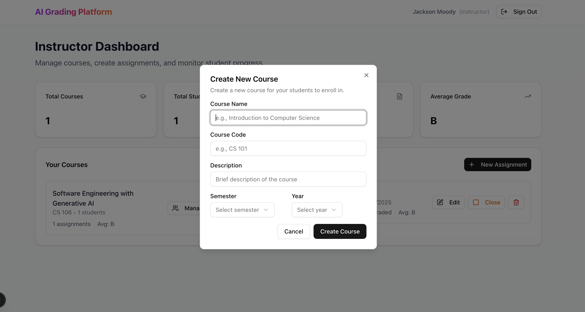
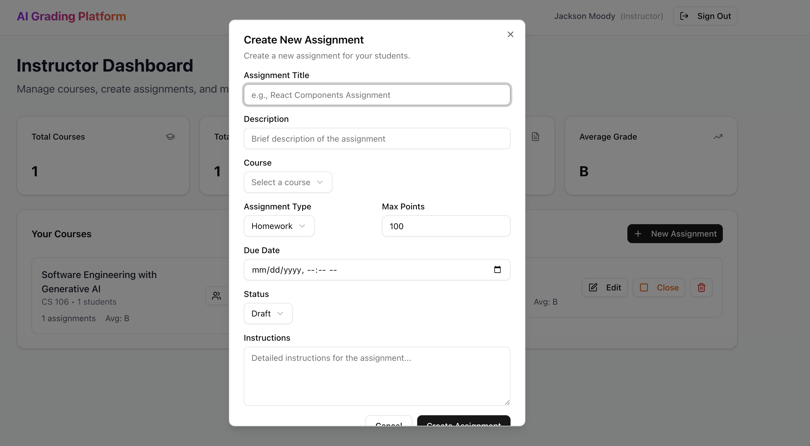
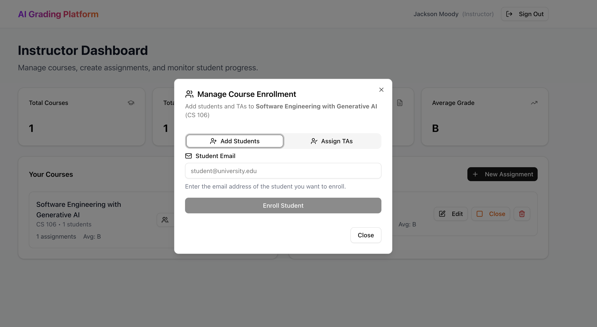
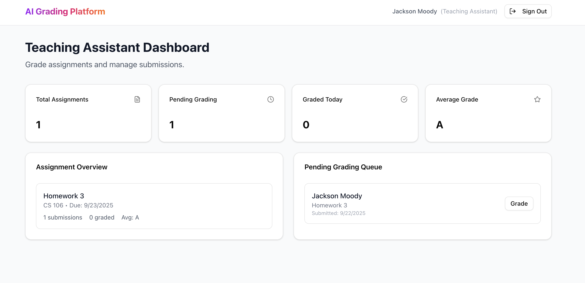
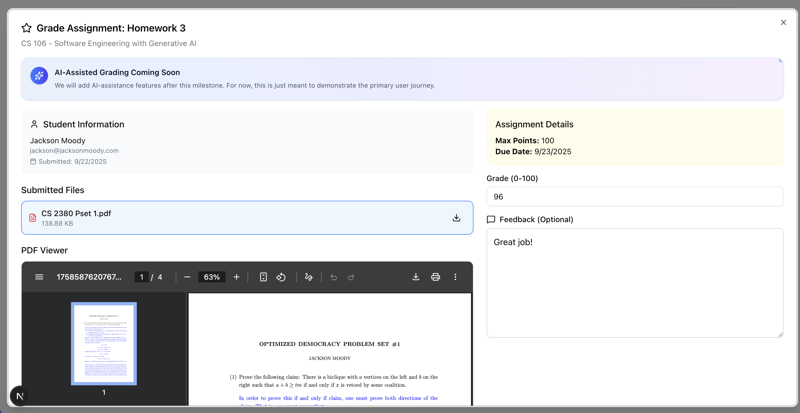
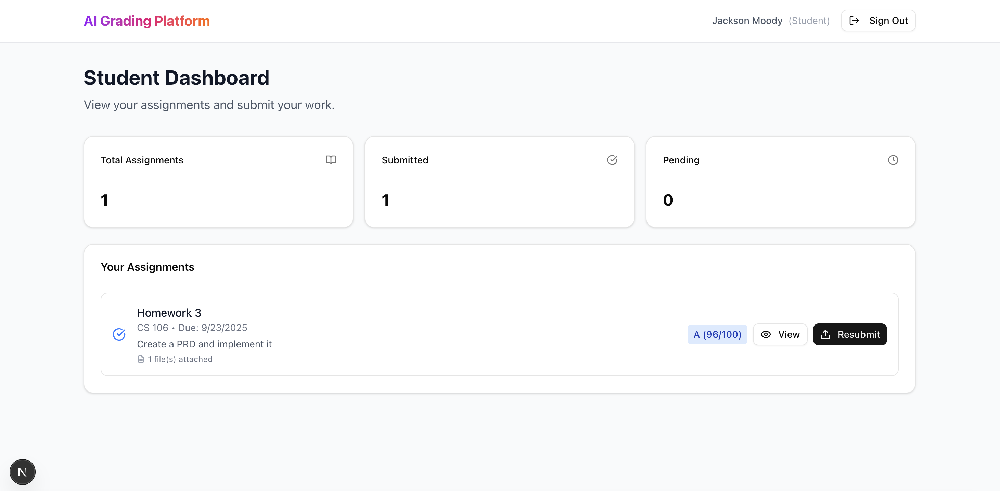
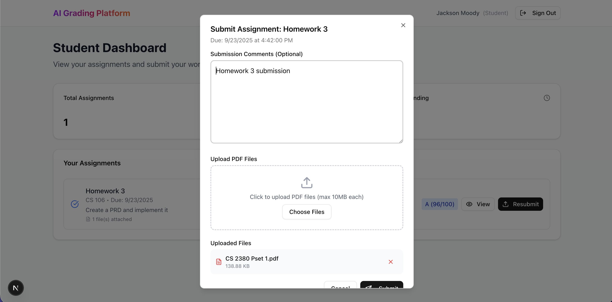

# autograder-project
AI-assisted platform to accelerate grading and increase accuracy.

Google Drive: https://drive.google.com/drive/folders/1DzP-ny6q2N0FCIQIv-6ZH8mwM9E5JaQR?usp=sharing

## Testing this Project:

In order to see the full functionality of this project, you will need to create three seperate accounts (using three different email addresses). This will allow you to test the flows of the following users:

- Instructor
- TA
- Student

### Instructor

Has the ability to create a course, add a TA to the course, add a student to the course, and create assignments for the course. You should create the instructor account first, along with a mock course and assignment. Once you have done this, you can then create a TA account and a student account.

#### Screenshots:


_Instructor dashboard showing course overview and statistics_


_Course creation and management interface_


_Creating new assignments for courses_


_Adding TAs and students to courses_

### TA

Has the ability to view the course and grade assignments for the course. After creating a TA account, you can add it to the course you created as an instructor.

#### Screenshots:


_TA dashboard showing pending grading queue and assignment overview_


_PDF viewer and grading interface for reviewing student submissions_

### Student

Has the ability to view the course and submit assignments to the course. After creating the student account, you can then add it to the course you created as an instructor.

#### Screenshots:


_Student dashboard showing available assignments and submission status_


_Assignment submission interface with file upload and text input_

## Running the Project Locally:

Set the `NEXT_PUBLIC_APP_URL`, `NEXT_PUBLIC_SUPABASE_URL`, `NEXT_PUBLIC_SUPABASE_PUBLISHABLE_KEY`, `OPENAI_KEY`, and `CLAUDE_KEY` keys in the `.env.local` file. Then, run the development server:

```bash
npm run dev
# or
yarn dev
# or
pnpm dev
# or
bun dev
```

Open [http://localhost:3000](http://localhost:3000) with your browser to see the result.
